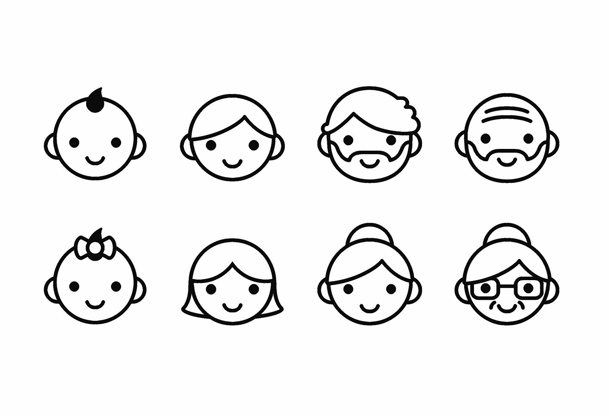

# Project 1 : Happiness in Different Life Stages: Similar or Not
by Haiqing Xu

```{r load libraries, warning = FALSE, message = FALSE, include = FALSE}
library(tidyverse)
library(mosaic)
library(tm)
library(SnowballC)
library(wordcloud)
library(RColorBrewer)
library(plyr)
library(tidytext)
library(topicmodels)
library(gplots)
```

```{r, echo = FALSE}
# load title image

```
from young to old

## --------------------------------------------------------------------------
## Distribution of Workers' Age
```{r, include = FALSE}
# load processed_moments and demographic data
clean_hm <- read.csv("../output/processed_moments.csv")
demo <- read.csv("../data/demographic.csv")
```

```{r}
# match worker id with their age and merge demographic data with clean_hm data for further analysis
# convert age from factor to numeric
# display the distribution of age
clean_hm <- merge(clean_hm, demo[, c("wid", "age", "gender", "marital", 
                                     "parenthood")], by="wid")
clean_hm$age <- as.numeric(clean_hm$age)
ggplot(clean_hm, aes(x = age)) + geom_histogram(color = "black", fill = "blue", binwidth = 1) + scale_x_continuous(breaks = seq(5,100,5))
```

Right skewness can be observed from this plot. Age is heavily distributed between 20 and 40.

## --------------------------------------------------------------------------
## First Glance: Do People in Different Age Groups Have Different Kinds of Happiness?
First, I will divide happy moments into three groups based on the age of worker in each happy moment: young adults (age 18 - 35); middle-aged adults (age 36 - 55); older adults (age greater than 55). Happy moments from workers with age less than 18 will not be used in this project. Happy moments from worker with age greater than 110 are also removed since the credibility of these age values is doubtful.
```{r}
# create a new variable "age_group", indicating which age group the worker of each happy moment belongs to
clean_hm2 <- clean_hm %>% filter(age >= 18 & age <= 110)
clean_hm2 <- mutate(clean_hm2, age_group = derivedFactor(
  "young" = (age >= 18 & age <= 35),
  "middle_aged" = (age >= 36 & age <= 55 ),
  "older" = (age >= 56),
  .default = NA
))
```

Let us look at the distribution of predicted happiness category among these three groups.
```{r}
category.bygroup <- clean_hm2 %>% select(predicted_category, age_group) %>%
  group_by(age_group, predicted_category) %>% dplyr::summarise( n = n()) %>%
  dplyr::mutate(freq = n / sum(n)) 
ggplot(category.bygroup,aes(x = predicted_category, y = freq, fill = age_group))+geom_col(position='dodge') + coord_flip()
```

It seems there is no big difference among three age groups based on the frequency of predicted happiness categories. For all three groups, the dominant categories of happiness are "affection" and "achievement".

## --------------------------------------------------------------------------
## Word Cloud: What Exactly Did They Say?
In this part, I tried to see what are the most frequently words said by workers in each age group.
```{r, warning = FALSE, message = FALSE, include = FALSE}
# divide data in three groups and load happy moments in each group as a corpus, clean the text (convert all the letters to lower case, remove puntuation, numbers, empty words and extra white space)
create.corpus <- function(df){
  words <- Corpus(VectorSource(df$text))
  return(words)
}

words.age <- dlply(clean_hm2, .(age_group), create.corpus)
```


Word Cloud for Young Adults
```{r, warning = FALSE}
tdm.young <- TermDocumentMatrix(words.age$young) %>% tidy()
tdm.young.freq <- tdm.young %>% group_by(term) %>% dplyr::summarise(count = n())
wordcloud(words = tdm.young.freq$term, freq = tdm.young.freq$count, min.freq = 1,max.words=100, random.order=FALSE, rot.per=0.35, 
          colors=brewer.pal(8, "Dark2"))
```

Word Cloud for Middle-Aged Adults
```{r, warning = FALSE}
tdm.middle <- TermDocumentMatrix(words.age$middle) %>% tidy()
tdm.middle.freq <- tdm.middle %>% group_by(term) %>% dplyr::summarise(count = n())
wordcloud(words = tdm.middle.freq$term, freq = tdm.middle.freq$count, min.freq = 1,max.words=100, random.order=FALSE, rot.per=0.35, 
          colors=brewer.pal(8, "Accent"))
```

Word Cloud for Older Adults
```{r, warning = FALSE}
tdm.older <- TermDocumentMatrix(words.age$older) %>% tidy()
tdm.older.freq <- tdm.older %>% group_by(term) %>% dplyr::summarise(count = n())
wordcloud(words = tdm.older.freq$term, freq = tdm.older.freq$count, min.freq = 1,max.words=100, random.order=FALSE, rot.per=0.35, 
          colors=brewer.pal(8, "Set1"))
```

In all three wordclouds, "friend", "day" and "time" are mentioned frequently. One noticable difference is that as age increases, workers start to talk about daughter and son more often in their happy moments. This is a natural process since usually, people start to have their own families as their age grows. 

```{r}
# happy moments provided by workers with empty parenthood status are removed in the following graph
parenthood.bygroup <- clean_hm2 %>% filter(parenthood != "")%>% select(parenthood, age_group) %>%
  group_by(age_group, parenthood) %>% dplyr::summarise( n = n()) %>%
  dplyr::mutate(freq = n / sum(n)) 
ggplot(parenthood.bygroup,aes(x = parenthood, y = freq, fill = age_group))+geom_col(position='dodge') + ggtitle("Age Distribution in Parenthood Status")
```

The plot shows that in happy moments provided by older adults, around 70% of the moments are written by workers who have children while in happy moments provided by young adults, this number is less than 30%.

Now a logical question to ask is: for workers in different age groups, does having children or not make a difference to their happy moments?
To answer this questions, I made separate word clouds for workers in the same age group based on whether they have children or not.
```{r}
# # happy moments provided by workers with empty parenthood status are removed for the purpose of the following analysis
words.age.par <- dlply( clean_hm2 %>% filter(parenthood != ""), .(age_group, parenthood), create.corpus)
```

Wordcloud for Young Adults with Children (Left) vs. Young Adults without Children (Right)
```{r, warning = FALSE}
tdm.young.y <- TermDocumentMatrix(words.age.par$young.y) %>% tidy()
tdm.young.y.freq <- tdm.young.y %>% group_by(term) %>% dplyr::summarise(count = n())
tdm.young.n <- TermDocumentMatrix(words.age.par$young.n) %>% tidy()
tdm.young.n.freq <- tdm.young.n %>% group_by(term) %>% dplyr::summarise(count = n())
par(mfrow = c(1,2), mar = rep(0.5,4) )
wordcloud(words = tdm.young.y.freq$term, freq = tdm.young.y.freq$count, min.freq = 1,max.words=100, random.order=FALSE, rot.per=0.35, 
          colors=brewer.pal(8, "Dark2"))
wordcloud(words = tdm.young.n.freq$term, freq = tdm.young.n.freq$count, min.freq = 1,max.words=100, random.order=FALSE, rot.per=0.35, 
          colors=brewer.pal(8, "Dark2"))
```

Wordcloud for Middle-Aged Adults with Children (Left) vs. Middl-Aged Adults without Children (Right)
```{r, warning = FALSE}
tdm.middle.y <- TermDocumentMatrix(words.age.par$middle_aged.y) %>% tidy()
tdm.middle.y.freq <- tdm.middle.y %>% group_by(term) %>% dplyr::summarise(count = n())
tdm.middle.n <- TermDocumentMatrix(words.age.par$middle_aged.n) %>% tidy()
tdm.middle.n.freq <- tdm.middle.n %>% group_by(term) %>% dplyr::summarise(count = n())
par(mfrow = c(1,2), mar = rep(0.5,4) )
wordcloud(words = tdm.middle.y.freq$term, freq = tdm.middle.y.freq$count, min.freq = 1,max.words=100, random.order=FALSE, rot.per=0.35, 
          colors=brewer.pal(8, "Accent"))
wordcloud(words = tdm.middle.n.freq$term, freq = tdm.middle.n.freq$count, min.freq = 1,max.words=100, random.order=FALSE, rot.per=0.35, 
          colors=brewer.pal(8, "Accent"))
```


Wordcloud for Older Adults with Children (Left) vs. Older Adults without Children (Right)
```{r, warning = FALSE}
tdm.older.y <- TermDocumentMatrix(words.age.par$older.y) %>% tidy()
tdm.older.y.freq <- tdm.older.y %>% group_by(term) %>% dplyr::summarise(count = n())
tdm.older.n <- TermDocumentMatrix(words.age.par$older.n) %>% tidy()
tdm.older.n.freq <- tdm.older.n %>% group_by(term) %>% dplyr::summarise(count = n())
par(mfrow = c(1,2), mar = rep(0.5,4) )
wordcloud(words = tdm.older.y.freq$term, freq = tdm.older.y.freq$count, min.freq = 1,max.words=100, random.order=FALSE, rot.per=0.35, 
          colors=brewer.pal(8, "Set2"))
wordcloud(words = tdm.older.n.freq$term, freq = tdm.older.n.freq$count, min.freq = 1,max.words=100, random.order=FALSE, rot.per=0.35, 
          colors=brewer.pal(8, "Set2"))
```

Within each age group, for people who have children, "daughter" and "son" are among the most frequent words in their happy moments. Especially when we compare among different age groups, we can see that for young adults, friend is still a big theme in the word clouds regardless of parenthood. However, for middle aged workers with children, they start to mention "daughter" and "son" more frequently than "friend". For older adults with children, the word "friend" just disappears from the wordcloud. On the contrast, for people who do not have children, regardless of which age group they are in, "friend" is always among the most frequent words.

## --------------------------------------------------------------------------
## Topic Allocation: Do they focus on the same topic?
I experimented choosing different number of topics using the LDA algorithm. It turns out that when the number of topics is large, topics tend to have repeated keywords. Finally, I decide to choose 4 topics. 
```{r}
words.all <- create.corpus(clean_hm2)
dtm.all <- DocumentTermMatrix(words.all)
# remove empty rows in the matrix for LDA purpose
dtm.new <-  dtm.all[unique(dtm.all$i),]
words.lda <- LDA(dtm.new, k = 4, control = list(seed = 111))
```

```{r}
words.topics <- tidy(words.lda, matrix = "beta")
top.terms <- words.topics %>%
  group_by(topic) %>%
  top_n(12, beta) %>%
  ungroup() %>%
  arrange(topic, -beta)
top.terms %>%
  mutate(term = reorder(term, beta)) %>%
  ggplot(aes(term, beta, fill = factor(topic))) +
  geom_col(show.legend = FALSE) +
  facet_wrap(~ topic, nrow = 2, scales = "free") + ggtitle("Most Common Terms within Each Topic") +
  coord_flip()+ theme(axis.text.y = element_text(size = 6),
                        axis.text.x = element_text(size = 8))
```

Based on most common terms within each topics, we can approxiately assign a theme to each topic.
Topic 1: Entertainment ("played", "game", "surprise")
Topic 2: Leisure and shopping ("bought", "dinner", "money")
Topic 3: Social events ("job", "event", "enjoyed")
Topic 4: Gathering and celebration ("friend", "school", "birthday")

Next, I want to explore whether workers in different age groups focus on different topics. For each happy moment, I assign it to the topic with highest probability. I create a heatmap to visualize the weights of topic allocation among three age groups.

```{r}
# document-topic probabilities
doc.topics <- tidy(words.lda, matrix = "gamma") %>%
  group_by(document) %>%
  top_n(1, gamma) %>%
  ungroup()
```


```{r}
# divide documents based on age group
young.topics <- doc.topics %>% filter(as.numeric(document) %in% which(clean_hm2$age_group == "young"))
middle.topics <- doc.topics %>% filter(as.numeric(document) %in% which(clean_hm2$age_group == "middle_aged"))
older.topics <- doc.topics %>% filter(as.numeric(document) %in% which(clean_hm2$age_group == "older"))
# calculate average topic allocation for each group
avg.topics <- function(df){
  return(table(df$topic)/nrow(df))
}
age.topics <- matrix( c( avg.topics(young.topics), 
                            avg.topics(middle.topics),
                            avg.topics(older.topics)),
                         ncol = 4, byrow = TRUE)
rownames(age.topics) <- c("young", "middle_aged", "older")
colnames(age.topics) <- paste("Topic", 1:4, sep = "")
heatmap.2(age.topics,
           scale = "none",key = F,
           col = bluered(100),
           cexRow = 0.9, cexCol = 0.9, margins = c(8, 8),
           trace = "none", density.info = "none")
```

From the heatmap, different age groups do have slight difference in weights in terms of topic allocation. Young adults and middle_aged adults tend to talk more about Topic 3 (Entertainment) while older adults talk more about Topic 4 (Gathering and celebration). Nevertheless, the heatmap indicates that the difference among age groups is not large.

## --------------------------------------------------------------------------
## Conclusion
1. For all three age groups, the dominant categories of happiness are "affection" and "achievement".
2. If we simply divide happy moments based on the age of workers, "friend" is always a big theme in the wordclouds regardless of age group. Meanwhile, it seems as people ages, they mention their children (e.g. "daughter" and "son") more frequently. After further dividing workers in each age group based on parenthood, we find out for older adults with children, the word "friend" is no longer among the most frequent words anymore. For people who do not have children, the wordclouds look similiar regardless of age group.
3. Using topic modelling, we observe slight differences in topic allocation among three age groups.

## --------------------------------------------------------------------------
References:
1. Image "from young to old": https://valleyadvocate.com/wp-content/uploads/2016/12/ThinkstockPhotos-488813170.jpg
2. ADS starter code for project 1: https://github.com/TZstatsADS/ADS_Teaching/tree/master/Projects_StarterCodes/Project1-RNotebook
3. "Text Mining with R", Chapter 6: https://www.tidytextmining.com/topicmodeling.html
